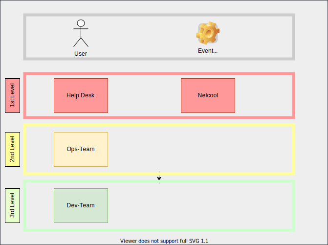

:jbake-menu: -
:jbake-type: page
ifndef::attributes-loaded[include::../../_attributes.adoc[]]

[[section-processes-incm]]

= Incident und Problem Management

[.arc42help]
****
.Motivation
Einstieg in die Werkzeuge für das Incident-Management, Grundlage für den 1st- und 2nd-Level-Support.

.Inhalt

* Links
** Agora
** SaViS
** iRID
** ITSM Zuweisungsgruppe
* Plan zur Ticketweitergabe

TIP: Ab vor. 06/21 ersetzt ein iRID-Modul in ITSM die eigenständige Anwendung iRID. Das neue Modul erspart euch
den eigenen Verweis auf iRID sowie die grafische Darstellung der Ticketweitergabe.
Das neue ITSM-Modul wird Kommunikation- und Bereitschaftspläne beinhalten.

.Format
Tabellarische Übersicht

.Quelle
Die Links sollten irgendwann automatisch generiert werden. Die Beispieltabelle macht aktuell von verschiedenen Variablen
Gebrauch.

Anstatt die Variablen zu setzen, könnt ihr auch direkt die Links in der Tabelle ersetzen entsprechend der Anleitung unter
https://dbsystel.wiki.intranet.deutschebahn.com/wiki/pages/viewpage.action?pageId=50468165[Agora Handlungsanweisungen verlinken] und
https://dbsystel.wiki.intranet.deutschebahn.com/wiki/pages/viewpage.action?pageId=50467891[Kommunikationsplan in SaViS verlinken]

ITSM ist hier nur ein Beispiel für eine Anwendung!

****

:techname: itsm
:irid_id: 2028
:savis_id: TVF010242
:itsm_zuordnungsgruppe: L2_ADMS

[cols="h,1",techname="Athene"]
|===

|https://agora.dbmc.comp.db.de/[Agora] Handlungsanweisungen
|https://agora.dbmc.comp.db.de/agora/explorer?techname={techname}&template=event&status=2[Link zu Handlungsanweisungen von {techname}]

|https://irid.noncd.rz.db.de/[iRID] Kommunikationsplan
|https://irid.noncd.rz.db.de/irid/kplan.jsf?teilVerfahrenId={irid_id}[Link zu Teilverfahren {irid_id}]

|https://itsm.noncd.rz.db.de/[ITSM] Zuweisungsgruppe
|{itsm_zuordnungsgruppe}

|https://savis.svs2p.dbmc.comp.db.de/[SaViS] Statusmeldung
|https://savis.svs2p.dbmc.comp.db.de/verfahren.php?tvf_id={savis_id}[Link zu SaViS Teilverfahren {savis_id}]

|===

.Ticketweitergabe

// Der Plan lässt sich mit einem Tool deiner Wahl erstellen.
// Die Vorlage beinhaltet folgende vorbereitete Optionen:
// Über Mermaid als Diagramm-Mark-up. Sobald ein Renderer-Service
// verfügbar ist können wir die mmd-Datei direkt wie folgt einbinden:

[mermaid, 03-incident-and-problem-management.mmd, png]
----
include::03-incident-and-problem-management.mmd[]
----

// derzeit ist der Workaround, das mmd in DrawIO einzubinden
//image::03-incident-and-problem-management.mermaid.drawio.svg[]

// alternativ lässt sich das Bild auch in Draw.IO zeichnen

